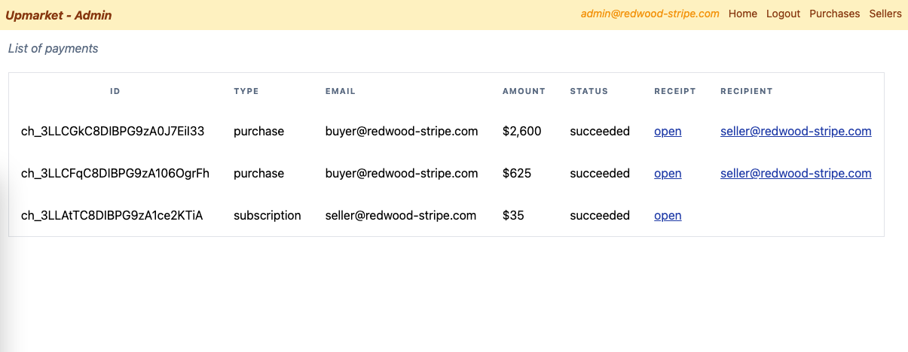
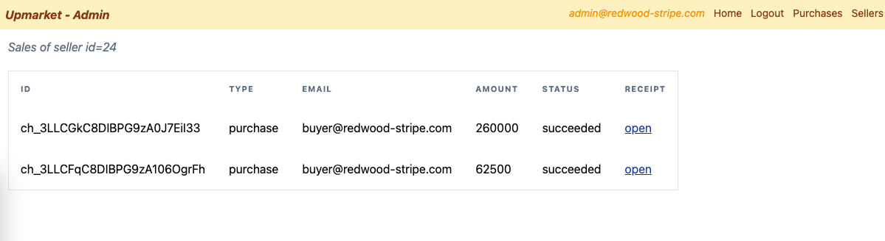

# Manage subscriptions and payments

## Create an admin section

First let's create a user with an admin role. Signup as a regular user and in the db, add the admin role using your sql client (I am using table plus but of course there are plenty of options out there). The SQL command is:

```sql
UPDATE "public"."User" SET "roles" = '{admin}' WHERE "id" = 9;
```

If your admin user ID is 9

Now we can create the actual admin page:

```
yarn rw g page admin
```

## List payments service

To retrieve all the payments from Stripe, we will use the [list all charges](https://stripe.com/docs/api/charges/list) endpoint.
We can test it to see what it returns first:

```
curl -G https://api.stripe.com/v1/charges \
  -u sk_test_XXXXXXXXXXXXX \
  -d limit=3
```

We can create a new sdl file for payments. We're not going to use the redwood sdl generator this time, because we don't have a corresponding model for payments in our schema.prisma file. So we will create this service "manually".

Create `api/src/graphql/payments.sdl.ts` and add this code:

```ts
export const schema = gql`
  type Payment {
    stripeId: String!
    fromEmail: String!
    amount: Int!
    status: String!
    receiptUrl: String!
  }

  type Query {
    payments: [Payment!]! @requireAuth
  }
`
```

Create `api/src/services/payments/payments.ts` and add this code:

```ts
import { stripe } from 'src/lib/stripe'
import type { QueryResolvers } from 'types/graphql'

export const payments: QueryResolvers['payments'] = async () => {
  const charges = await stripe.charges.list()
  return charges.data.map((charge) => ({
    stripeId: charge.id,
    fromEmail: charge.billing_details.name,
    amount: charge.amount,
    status: charge.status,
    receiptUrl: charge.receipt_url,
  }))
}
```

You can test this by replacing `@requireAuth` with `@skipAuth` in `payments.sdl.ts` and executing this command:

```
curl --location --request POST 'http://localhost:8910/.redwood/functions/graphql' \
--header 'Content-Type: application/json' \
--data-raw '{"query":"query { payments {stripeId fromEmail amount status receiptUrl}}","variables":{}}'
```

## List payment frontend

In our new admin page we will create a Cell whose job will be to list the payments.

```
yarn rw g cell listPayments --list
```

Copy this code in `web/src/components/ListPaymentsCell/ListPaymentsCell.tsx`:

```tsx
import type { ListPaymentsQuery } from 'types/graphql'
import type { CellSuccessProps, CellFailureProps } from '@redwoodjs/web'
import { Link, routes } from '@redwoodjs/router'

export const QUERY = gql`
  query ListPaymentsQuery($userId: Int) {
    payments(userId: $userId) {
      stripeId
      fromEmail
      amount
      status
      receiptUrl
      type
      connectedAccountEmail
      connectedAccountId
    }
  }
`

export const Loading = () => <div>Loading...</div>

export const Empty = () => <div>Empty</div>

export const Failure = ({ error }: CellFailureProps) => (
  <div style={{ color: 'red' }}>Error: {error.message}</div>
)

export const Success = ({ payments }: CellSuccessProps<ListPaymentsQuery>) => {
  return (
    <>
      <table className="border">
        <thead className="text-left">
          <tr
            className="text-slate-500 uppercase tracking-widest"
            style={{ fontSize: '11px' }}
          >
            <th className="text-center p-4">id</th>
            <th className="p-4">type</th>
            <th className="p-4">email</th>
            <th className="p-4">amount</th>
            <th className="p-4">status</th>
            <th className="p-4">receipt</th>
            <th className="p-4">recipient</th>
          </tr>
        </thead>
        <tbody>
          {payments.map((item) => {
            return (
              <tr key={item.stripeId}>
                <td className="p-4">{item.stripeId}</td>
                <td className="p-4">{item.type}</td>
                <td className="p-4">{item.fromEmail}</td>
                <td className="p-4">
                  $
                  {item.amount.toLocaleString(undefined, {
                    minimumFractionDigits: 0,
                  })}
                </td>
                <td className="p-4">{item.status}</td>
                <td className="p-4">
                  <a
                    href={item.receiptUrl}
                    target="_blank"
                    rel="noreferrer"
                    className="text-blue-800 underline"
                  >
                    open
                  </a>
                </td>
                <td className="p-4">
                  {!!item.connectedAccountEmail && (
                    <Link
                      className="text-blue-800 underline"
                      to={routes.sellerAdmin({
                        userId: `${item.connectedAccountId}`,
                      })}
                    >
                      {item.connectedAccountEmail}
                    </Link>
                  )}
                </td>
              </tr>
            )
          })}
        </tbody>
      </table>
    </>
  )
}
```

Now we can update `web/src/pages/AdminPage/AdminPage.tsx`:

```tsx
import { MetaTags } from '@redwoodjs/web'
import ListPaymentsCell from 'src/components/ListPaymentsCell'

const AdminPage = () => {
  return (
    <>
      <MetaTags title="Admin" description="Admin page" />

      <h1 className="text-slate-500 mb-5 italic">List of payments</h1>
      <ListPaymentsCell />
    </>
  )
}

export default AdminPage
```



## Add recipient and payment type

Some problems with this first list:

- Subscriptions are indistinguishable from purchase
- Purchases are not linked to the connected account

We are not creating the payment for the subscription directly, it is created when we call `stripe.subscriptions.create` and it gets created with a description that says 'Subscription creation'. But we do create the payment intents for purchases: We can use the `metadata` optional field in the `stripe.paymentIntents.create` call to set the type of purchase and add the connected account id and email.

In `api/src/functions/createPaymentIntent/createPaymentIntent.ts` replace the `stripe.paymentIntents.create` call with:

```ts
const paymentIntent = await stripe.paymentIntents.create({
  amount: product.price * 100,
  currency: 'usd',
  customer: user.stripeCustomerId,
  automatic_payment_methods: {
    enabled: true,
  },
  application_fee_amount:
    product.price *
    +process.env[`PLATFORM_FEE_${product.user.subscriptionName.toUpperCase()}`],
  transfer_data: {
    destination: product.user.stripeAccountId,
  },
  metadata: {
    type: 'purchase',
    connectedAccountEmail: product.user.email,
    connectedAccountId: product.user.id,
  },
})
```

Let's now add the type and the connected account to `payment.sdl.ts`:

```graphql
type Payment {
  stripeId: String!
  fromEmail: String!
  amount: Int!
  status: String!
  receiptUrl: String!
  type: String!
  connectedAccountEmail: String
  connectedAccountId: Int
}
```

And to `api/src/services/payments/payments.ts`:

```ts
export const payments: QueryResolvers['payments'] = async () => {
  const charges = await stripe.charges.list()
  return charges.data.map((charge) => ({
    stripeId: charge.id,
    fromEmail: charge.billing_details.name,
    amount: charge.amount,
    status: charge.status,
    receiptUrl: charge.receipt_url,
    c
    connectedAccountId: +charge.metadata?.connectedAccountId || undefined,
    type:
      charge.metadata?.type ||
      (charge.description === 'Subscription creation'
        ? 'subscription'
        : 'unknown'),
  }))
}
```

In the frontend, we can now add 2 columns to our table in `web/src/components/ListPaymentsCell/ListPaymentsCell.tsx`:

```tsx
import type { ListPaymentsQuery } from 'types/graphql'
import type { CellSuccessProps, CellFailureProps } from '@redwoodjs/web'

export const QUERY = gql`
  query ListPaymentsQuery {
    payments {
      stripeId
      fromEmail
      amount
      status
      receiptUrl
      type
      connectedAccountEmail
      connectedAccountId
    }
  }
`

export const Loading = () => <div>Loading...</div>

export const Empty = () => <div>Empty</div>

export const Failure = ({ error }: CellFailureProps) => (
  <div style={{ color: 'red' }}>Error: {error.message}</div>
)

export const Success = ({ payments }: CellSuccessProps<ListPaymentsQuery>) => {
  return (
    <>
      <table>
        <thead>
          <tr>
            <th>id</th>
            <th>type</th>
            <th>email</th>
            <th>amount</th>
            <th>status</th>
            <th>receipt</th>
            <th>recipient</th>
          </tr>
        </thead>
        <tbody>
          {payments.map((item) => {
            return (
              <tr key={item.stripeId}>
                <td>{item.stripeId}</td>
                <td>{item.type}</td>
                <td>{item.fromEmail}</td>
                <td>{item.amount}</td>
                <td>{item.status}</td>
                <td>
                  <a href={item.receiptUrl} target="_blank" rel="noreferrer">
                    open
                  </a>
                </td>
                <td>
                  {!!item.connectedAccountEmail && (
                    <div>{item.connectedAccountEmail}</div>
                  )}
                </td>
              </tr>
            )
          })}
        </tbody>
      </table>
    </>
  )
}
```

## Retrieve sellers' payouts

We want to use `stripe.charges.list` to list the charges for a connected account (see [here](https://stripe.com/docs/api/charges/list)). Unfortunately, there is no connected account param that we can query against. We need to use the `transfer_group` parameter. But this needs to be added on the payment intent first.

Open `api/src/functions/createPaymentIntent/createPaymentIntent.ts` and modify the `paymentIntent` creation like this:

```ts
const paymentIntent = await stripe.paymentIntents.create({
  amount: product.price * 100,
  currency: 'usd',
  customer: user.stripeCustomerId,
  automatic_payment_methods: {
    enabled: true,
  },
  application_fee_amount:
    product.price *
    +process.env[`PLATFORM_FEE_${product.user.subscriptionName.toUpperCase()}`],
  transfer_data: {
    destination: product.user.stripeAccountId,
  },
  metadata: {
    type: 'purchase',
    connectedAccountEmail: product.user.email,
    connectedAccountId: product.user.id,
  },
  transfer_group: `${product.user.id}`,
})
```

Now that the `transfer_group` is the `userId` we can query the charges for this `transfer_group`. We need to now modify our payments query.
First, add an optional `userId` param to the query in `payments.sdl.ts`:

```graphql
payments(userId: Int): [Payment!]! @requireAuth
```

Then modify the implementation of the service in `api/src/services/payments/payments.ts`:

```ts
import { stripe } from 'src/lib/stripe'
import type { QueryResolvers } from 'types/graphql'

export const payments: QueryResolvers['payments'] = async ({
  userId,
}: {
  userId?: number
}) => {
  const params = userId ? { transfer_group: `${userId}` } : {}
  const charges = await stripe.charges.list(params)
  return charges.data.map((charge) => ({
    stripeId: charge.id,
    fromEmail: charge.billing_details.name,
    amount: charge.amount,
    status: charge.status,
    receiptUrl: charge.receipt_url,
    connectedAccountEmail: charge.metadata?.connectedAccountEmail,
    connectedAccountId: +charge.metadata?.connectedAccountId || undefined,
    type:
      charge.metadata?.type ||
      (charge.description === 'Subscription creation'
        ? 'subscription'
        : 'unknown'),
  }))
}
```

## Display sellers' payouts

Let's create a seller page where we will see the purchase linked to this seller.

```
yarn rw g page SellerAdmin
yarn rw g cell Sales --list
```

The cell's query is almost identical to `ListPaymentsCell.tsx`:

```tsx
export const QUERY = gql`
  query ListPaymentsQuery($userId: Int) {
    payments(userId: $userId) {
      stripeId
      fromEmail
      amount
      status
      receiptUrl
      type
      connectedAccountEmail
      connectedAccountId
    }
  }
`
```

Copy this code for `SellerAdminPage.tsx`:

```tsx
import { useParams } from '@redwoodjs/router'
import { MetaTags } from '@redwoodjs/web'
import SalesCell from 'src/components/SalesCell'

const SellerAdminPage = () => {
  const { userId } = useParams()
  return (
    <>
      <MetaTags title="Seller Admin" description="Seller Admin page" />

      <h1 className="text-slate-500 mb-5 italic">
        Sales of seller id={userId}
      </h1>
      {userId && <SalesCell userId={+userId} />}
    </>
  )
}

export default SellerAdminPage
```

And `SalesCell.tsx` in its simplest form can look like this:

```tsx
import type { ListPaymentsQuery } from 'types/graphql'
import type { CellSuccessProps, CellFailureProps } from '@redwoodjs/web'

export const QUERY = gql`
  query ListPaymentsQuery($userId: Int) {
    payments(userId: $userId) {
      stripeId
      fromEmail
      amount
      status
      receiptUrl
      type
      connectedAccountEmail
      connectedAccountId
    }
  }
`

export const Loading = () => <div>Loading...</div>

export const Empty = () => <div>Empty</div>

export const Failure = ({ error }: CellFailureProps) => (
  <div style={{ color: 'red' }}>Error: {error.message}</div>
)

export const Success = ({ payments }: CellSuccessProps<ListPaymentsQuery>) => {
  return (
    <>
      <table className="border">
        <thead className="text-left">
          <tr
            className="text-slate-500 uppercase tracking-widest"
            style={{ fontSize: '11px' }}
          >
            <th className="p-4">id</th>
            <th className="p-4">type</th>
            <th className="p-4">email</th>
            <th className="p-4">amount</th>
            <th className="p-4">status</th>
            <th className="p-4">receipt</th>
          </tr>
        </thead>
        <tbody>
          {payments.map((item) => {
            return (
              <tr key={item.stripeId}>
                <td className="p-4">{item.stripeId}</td>
                <td className="p-4">{item.type}</td>
                <td className="p-4">{item.fromEmail}</td>
                <td className="p-4">{item.amount}</td>
                <td className="p-4">{item.status}</td>
                <td className="p-4">
                  <a
                    className="text-blue-800 underline"
                    href={item.receiptUrl}
                    target="_blank"
                    rel="noreferrer"
                  >
                    open
                  </a>
                </td>
              </tr>
            )
          })}
        </tbody>
      </table>
    </>
  )
}
```



## Seller list page

Right now the admin can only access the list of sellers from the the list of payments. It would certainly be interesting to get a list of all the sellers directly.

On the backend, create a new query in `user.sdl.ts`:

```graphql
type Query {
  users: [User!]! @requireAuth
  sellers: [User!]! @requireAuth
  user(id: Int!): User @requireAuth
}
```

in `api/src/services/users/users.ts`:

```ts
export const sellers: QueryResolvers['users'] = () => {
  return db.user.findMany({ where: { roles: { has: 'seller' } } })
}
```

We can now create a new page and add it to our main layout:

```
yarn rw g page SellerListAdmin
yarn rw g cell Sellers --list
```

With `SellerListAdminPage.tsx` simply rendering the cell:

```tsx
import { MetaTags } from '@redwoodjs/web'
import SellersCell from 'src/components/SellersCell'

const SellerListAdminPage = () => {
  return (
    <>
      <MetaTags title="Seller List" description="Seller List page" />

      <h1 className="text-slate-500 mb-5 italic">All Sellers</h1>
      <SellersCell />
    </>
  )
}

export default SellerListAdminPage
```

And with this code in `SellersCell.tsx`:

```tsx
import type { SellersQuery } from 'types/graphql'
import type { CellSuccessProps, CellFailureProps } from '@redwoodjs/web'
import { Link, routes } from '@redwoodjs/router'

export const QUERY = gql`
  query SellersQuery {
    sellers {
      id
      email
    }
  }
`

export const Loading = () => <div>Loading...</div>

export const Empty = () => <div>Empty</div>

export const Failure = ({ error }: CellFailureProps) => (
  <div style={{ color: 'red' }}>Error: {error.message}</div>
)

export const Success = ({ sellers }: CellSuccessProps<SellersQuery>) => (
  <ul>
    {sellers.map((item) => (
      <li key={item.id}>
        <Link
          className="text-blue-800 underline my-3"
          to={routes.sellerAdmin({ userId: `${item.id}` })}
        >
          {item.email}
        </Link>
      </li>
    ))}
  </ul>
)
```

## Add an admin layout

That's where we will access the list of sellers

```
yarn rw g layout AdminLayout
```

With this code:

```tsx
import { useAuth } from '@redwoodjs/auth'
import { Link, navigate, routes } from '@redwoodjs/router'
import { useEffect, useState } from 'react'

type AdminLayoutProps = {
  children?: React.ReactNode
}

const AdminLayout = ({ children }: AdminLayoutProps) => {
  const { isAuthenticated, currentUser, logOut } = useAuth()
  const [isAdmin, setIsAdmin] = useState(false)

  useEffect(() => {
    if (currentUser) {
      if (currentUser.roles.includes('admin')) {
        setIsAdmin(true)
      } else {
        navigate(routes.home())
      }
    }
  }, [currentUser])
  return (
    <div>
      <div className="overflow-hidden p-2 bg-amber-100 flex justify-between text-amber-800">
        <div className="font-bold italic">Upmarket - Admin</div>
        <nav>
          <ul className="flex gap-3 text-sm">
            {isAuthenticated && (
              <li className="text-amber-500 italic text-sm">
                {currentUser.email}
              </li>
            )}
            <li>
              <Link to={routes.home()}>Home</Link>
            </li>
            {isAdmin && (
              <>
                <li>
                  <button onClick={logOut}>Logout</button>
                </li>
                <li>
                  <Link to={routes.admin()}>Purchases</Link>
                </li>
                <li>
                  <Link to={routes.sellerListAdmin()}>Sellers</Link>
                </li>
              </>
            )}
          </ul>
        </nav>
      </div>
      <div className="m-3">{children}</div>
    </div>
  )
}

export default AdminLayout
```

And modify the admin section in `Routes.tsx` like this:

```tsx
import AdminLayout from './layouts/AdminLayout/AdminLayout'
...
<Set wrap={AdminLayout}>
  <Private unauthenticated="home" roles="admin">
    <Route path="/seller-list-admin" page={SellerListAdminPage} name="sellerListAdmin" />
    <Route path="/seller-admin/{userId:number}" page={SellerAdminPage} name="sellerAdmin" />
    <Route path="/admin" page={AdminPage} name="admin" />
  </Private>
</Set>
```

# We're done

Congrats! You're probably now sipping a margarita in the middle of your infinity pool on your new island in the Pacific, big enough to welcome a successful edition of the [Fyre festival](https://en.wikipedia.org/wiki/Fyre_Festival), and you're wondering, "what kind of products did we even sell?"

Actually there is a limit in the amount that Stripe allows you to charge, and that limit seems to be $999.999. So that's probably good for most goods, unless you want to sell an [island](https://www.privateislandsonline.com/asia/thailand/rangyai-island)...

I hope you enjoyed the tutorial. Or if you skipped to the end to check out where the repo with all the code [here it is](https://github.com/generalui/redwood-stripe.git)
